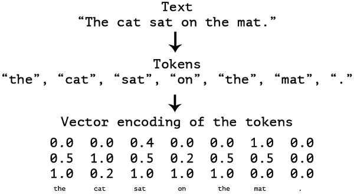

# Deep-Learning-for-text-and-sequences-
## We shall learn about following topics
1. How to tokenize text
2. what word emdebbings are
3. What RNN are and how to use them
4. How to stack RNN layers and use birections RNN to build a powerful sequence models
5. How to use 1D convnets for sequence processing
6. How to combine 1D convnets and RNNs to process long sequential models

Example: Timeseries regression
         Timeseries classification
         Anomaly detection in timeseries
         Sequence labelling
 Example: 1D convnets:

Machine translation (sequence-to-sequence convolutional models, like SliceNet).
Document classification.
Spelling correction.

## Deep learning models with input texts
Deep learning models do not take as input raw text: they only work with numeric tensors. Vectorizing text is the process of transforming text into numeric tensors. 
This can be done in multiple ways:

1. By segmenting text into words, and transforming each word into a vector.
2. By segmenting text into characters, and transforming each character into a vector.
3. 4tBy extracting "N-grams" of words or characters, and transforming each N-gram into a vector. "N-grams" are overlapping groups of multiple consecutive words or characters.

